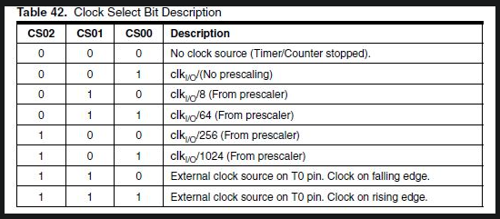
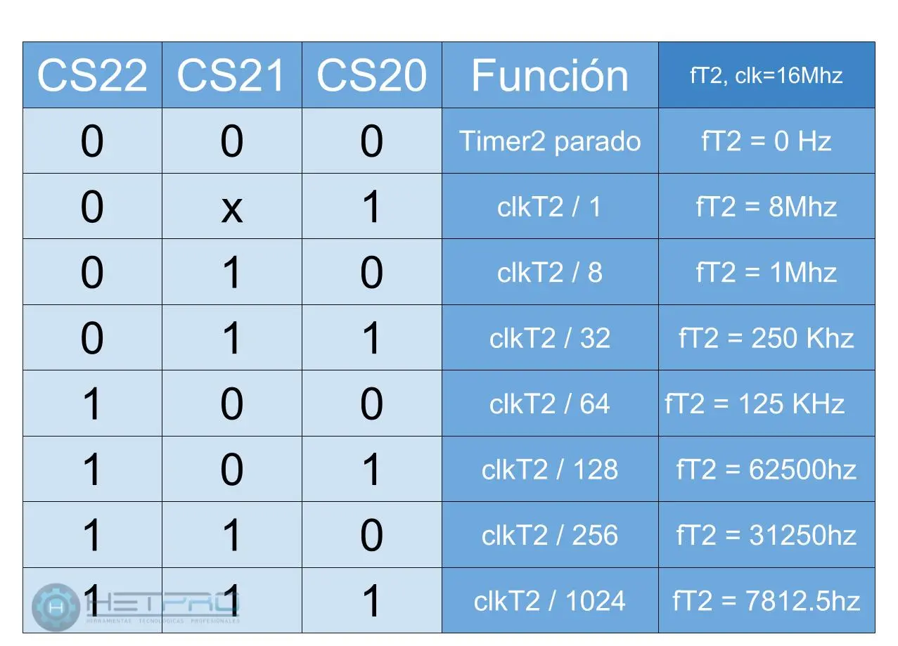

# Plantilla TP AED 3
Esta plantilla trae varias características para hacer la codificación 👨‍💻 del arduino NANO más simple.

Trae varias definiciones de tipos para una escritura más simple y rápida, estos son los siguientes:
```c
typedef uint8_t u8;
typedef uint16_t u16;
typedef uint32_t u32;
typedef uint64_t u64;
typedef int8_t i8;
typedef int16_t i16; 
typedef int32_t i32;
typedef int64_t i64;
typedef boolean bit;
```
Los tipos "u" seguidos por un número se refieren a una variable sin signo de x cantidad de bits. Lo mismo para los que empiezan con "i", estos se refieren a un dato tipo int normal con x cantidad de bits.
Además de definir bit como una variable de un bit valga la redundancia.


------------


Esta plantilla trae funciones para establecer los pines como entrada o salida.
```c
void establishPortIn(u8 PXX, u8 PORT_X, bit PULL_UP);
void establishPortOut(u8 PXX, u8 PORT_X);
```
en PXX podes colocar un valor del 0 al 7 representando los PD0 a PD7, los PB0 a PB5 o los PC0 a PC5, aunque para hacerlo más fácil se definieron las siguientes macros 🤓:
```c
#define PX0 (uint8_t)0b00000001
#define PX1 (uint8_t)0b00000010
#define PX2 (uint8_t)0b00000100
#define PX3 (uint8_t)0b00001000
#define PX4 (uint8_t)0b00010000
#define PX5 (uint8_t)0b00100000
#define PX6 (uint8_t)0b01000000
#define PX7 (uint8_t)0b10000000
```
en PORT_X podes colocar un valor del 0 al 2 para definir en qué puerto estas actuando, aunque acá también podes usar las siguientes macros:
```c
#define PORT_D (uint8_t)0
#define PORT_B (uint8_t)1
#define PORT_C (uint8_t)2
```
y en PULL_UP se coloca un 1 si queres activar ✔️ la resistencia PULL_UP o en 0 si no ❌

todo lo anterior se aplica para ambas funciones a excepción de PULL_UP .


------------


Se añadio también una función para configurar el timer 🕒
```c
void configTimerCMR(u8 TIMER_X, u8 PRESCALER, u16 CMR);
```
En TIMER_X se tiene que colocar que timer se va a usar, se debe poner un numero del 0 al 2 o las macros:

```c
#define TIMER0 0
#define TIMER1 1
#define TIMER2 2
```

En PRESCALER tenes que poner un numero del 0 al 7, estos correspondientes a las tablas de cada timer:
Para el timer0 y el timer1 es la siguiente tabla:



Para el timer 2 es la siguiente tabla:



En CMR tenes que poner el número en el que el timer resetea, CMR significa Compare on Match Register.

Ademas de la funcion del timer hay 4 estructuras de datos para hacer el delta de tiempo.
```c
typedef struct DifferentialPairsU8{
    u8 A;
    u8 B;
} DPU8;

typedef struct DifferentialPairsU16{
    u16 A;
    u16 B;
} DPU16;

typedef struct DifferentialPairsU32{
    u32 A;
    u32 B;
} DPU32;

typedef struct DifferentialPairsU64{
    u64 A;
    u64 B;
} DPU64;
```

Les dejo la [pagina](https://timer-interrupt-calculator.simsso.de/ "pagina") para calcular el timer acá.

------------

Acá te dejo una imagen del pinout del arduino para que labures 🛠️ más cómodo:


El repositorio tiene un archivo .simu que es un circuito del simulide con el arduino y varios componentes comunes para copiar y pegar.

Eso es todo por ahora, nada loco un saludo 😎 y aguante el frio 🧣